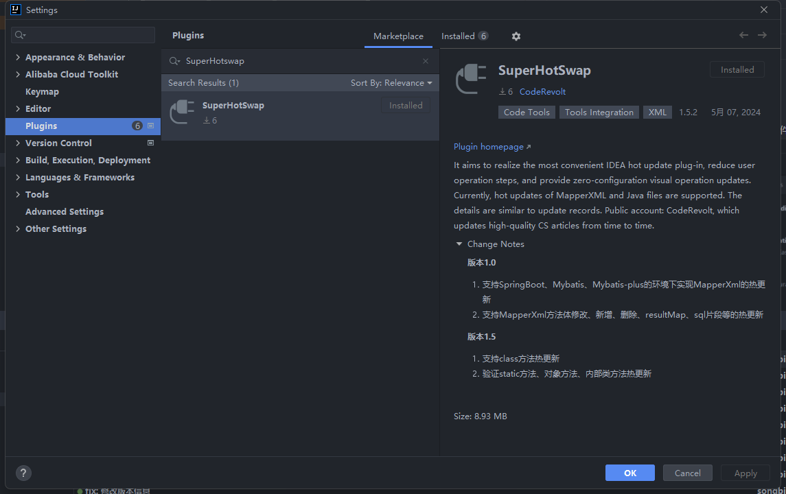
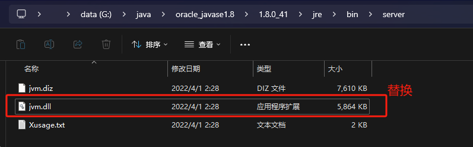

# SuperHotSwap
开发初心：旨在做出一款最便捷的IDEA热更新插件，减少用户操作步骤，提供零配置的可视化操作更新。

## 开发环境
- JDK1.8
- IDEA2021.3
- Gradle8.7

## 支持功能
| 支持功能      | 是否支持      | 说明             |
| ----------- |-----------|----------------|
| MybatisXML热更新      | √         ||
| Class热更新   | √ | 增强功能需安装dcevm补丁 |
| Spring热更新   | 进行中       ||
| ...   | ...       ||

## 使用流程
1. 在插件市场搜索安装

2. 启动项目

安装成功后重启IDEA，启动项目后输出Banner表示安装成功

3. Mapper热更新

在MapperXML文件下点击`File Hot Swap`按钮执行热更新指令，指令正常输出如下

4. Java热更新

idea文件自动保存是有延迟的，记得先手动ctrl+s保存一下

Instrumentation类重新加载的局限性
- 新类和老类的父类必须相同。
- 新类和老类实现的接口数也要相同，并且是相同的接口。
- 新类和老类访问符必须一致。
- 新类和老类字段数和字段名要一致。
- 新类和老类新增或删除的方法必须是private static/final修饰的。
- 可以修改方法体。

想要去除限制，需要安装jdk补丁，DECVM补丁下载地址：
[https://github.com/dcevm/dcevm](https://github.com/dcevm/dcevm)

下载对应jdk版本补丁，替换即可完成安装。

## 联系方式
<646997146@qq.com>
