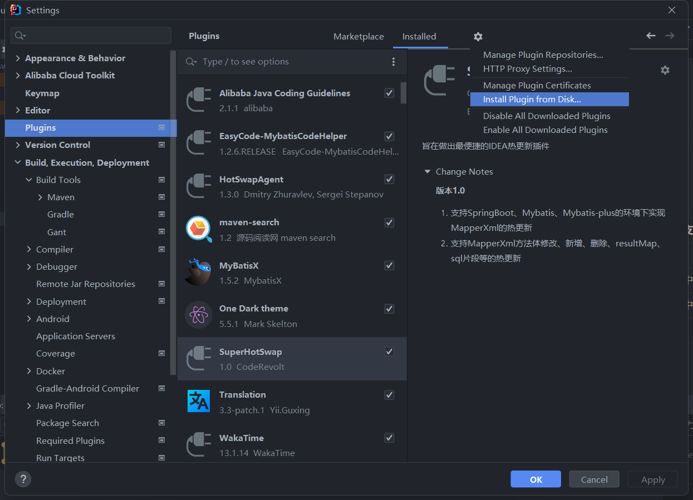
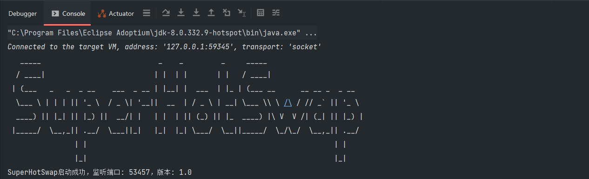
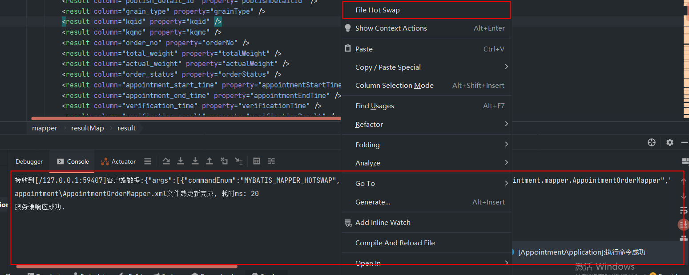

# SuperHotSwap
开发初心：旨在做出一款最便捷的IDEA热更新插件，减少用户操作步骤，提供零配置的可视化操作更新。

## 开发环境
- JDK1.8
- IDEA2021.3
- Gradle8.7

## 支持功能
| 支持功能      | 是否支持 |
| ----------- | ----------- |
| MybatisXML热更新      | √       |
| Class热更新   | 进行中        |
| Spring热更新   | 进行中        |
| ...   | ...        |

## 使用流程
1. 打开IDEA安装zip格式的插件

2. 启动项目

安装成功后重启IDEA，启动项目后输出Banner表示安装成功

3. 热更新

在MapperXML文件下点击`File Hot Swap`按钮执行热更新指令，指令正常输出如下

## 联系方式
<646997146@qq.com>
