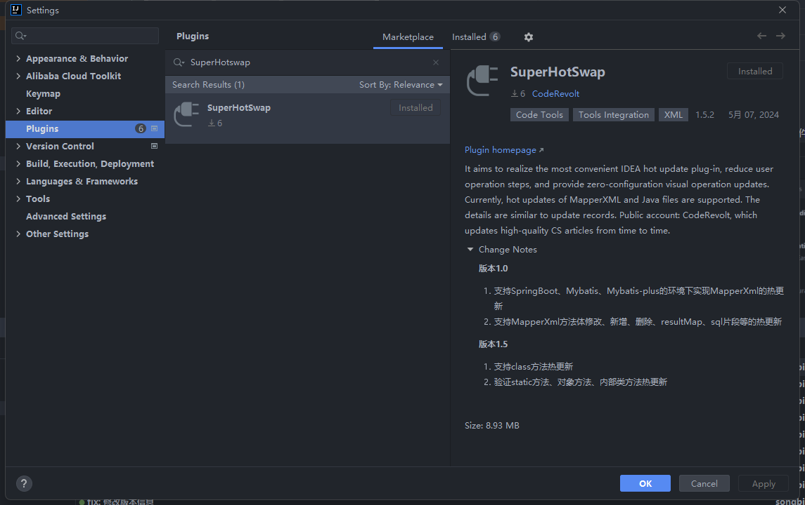
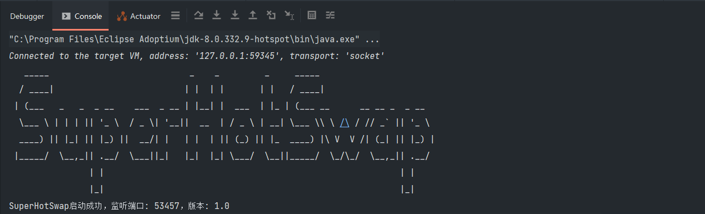
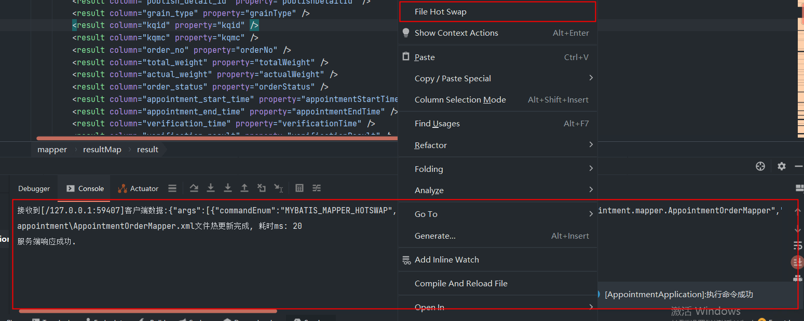
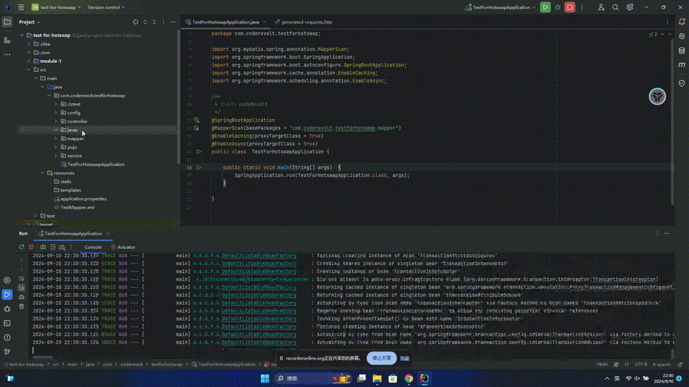
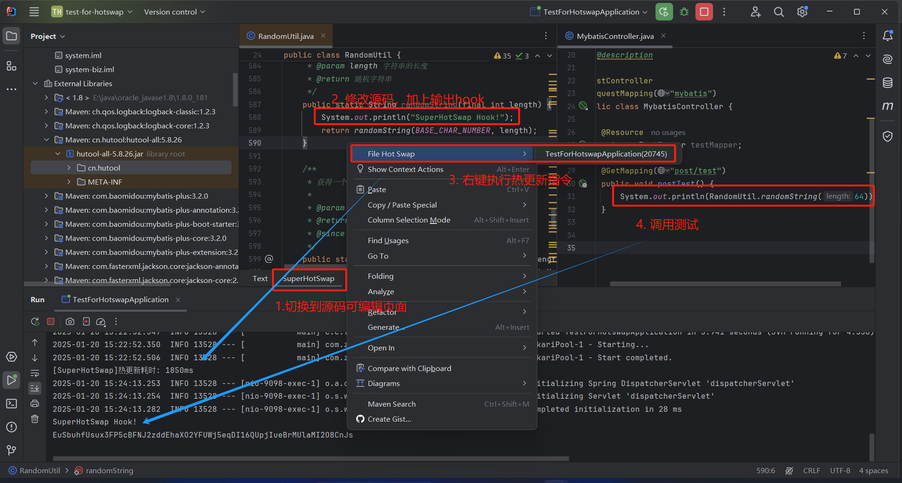
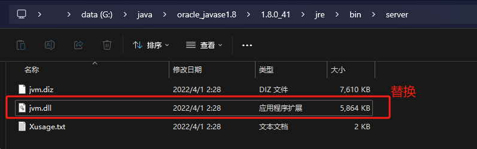
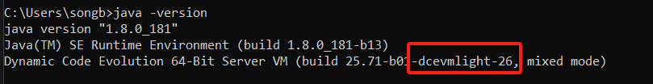

  

<h2 align="center">SuperHotSwap </h2>
<h4 align="center"><a href="./README.md">English</a> | <strong>简体中文</strong></h4>

开发初心：旨在做出一款最便捷的IDEA热更新插件，减少用户操作步骤，提供零配置的可视化操作更新。

## 开发环境

- JDK1.8
- IDEA2021.3
- Gradle8.7

## 支持功能

| 支持功能          | 是否支持 | 说明                                                                  |
|---------------|------|---------------------------------------------------------------------|
| MybatisXML热更新 | √    | 支持select/insert/delete/update/resultMap/parameterMap/sql/cache等内容热更新 |
| Class热更新      | √    | 原生支持方法内修改热更新。新增修改字段方法类、lombok注解热更新等增强功能需安装dcevm补丁，教程如下。             |
| Spring热更新     | √    | 支持bean注册，销毁。支持动态更新RequestMapping。                                   |
| 远程热更新         | 进行中  |                                                                     |
| ...           | ...  |                                                                     |

## 使用流程

1. 在插件市场搜索安装
   

2. 启动项目

安装成功后重启IDEA，启动项目后输出Banner表示安装成功

3. Mapper热更新

在MapperXML文件下点击`File Hot Swap`按钮执行热更新指令，指令正常输出如下

4. Java热更新

5. Spring热更新

支持动态创建、编辑、删除接口。演示如下。

6. jar文件热更新

支持.class文件和jar包内源码文件热更新。

## 安装热更新补丁
类热更新的局限性

- 新类和老类的父类必须相同。
- 新类和老类实现的接口数也要相同，并且是相同的接口。
- 新类和老类访问符必须一致。
- 新类和老类字段数和字段名要一致。
- 新类和老类新增或删除的方法必须是private static/final修饰的。
- 可以修改方法体。

想要去除限制，需要安装jdk补丁，DECVM补丁下载地址：
[https://github.com/dcevm/dcevm](https://github.com/dcevm/dcevm)

下载对应jdk版本补丁，替换即可完成安装。

输出版本，成功输出示例

## 联系方式

有偿提供支持帮助，联系方式如下。

gitee地址: https://gitee.com/song_biao/super-hot-swap

github地址: https://github.com/songbiaoself/SuperHotSwap

邮箱📫：<646997146@qq.com>

公众号: CodeRevolt
